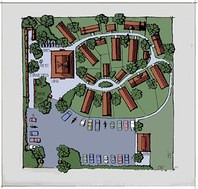

Tiny House Village a.k.a Geek Village
-------------------------------------

## The Idea

This would be a place to host things like Geek Weekend and would enable us to do it more often. It is also a place for any one of us and our familyies to just get away for vacation, long weekends, or group gatherings. We divide the cost equaly among everyone to make it really affordable.

## Ownsership

The current idea is to create an organization or association that would own the land. This organizations will have members that contribute monthly fees. These fees will be used to pay for expenses. Each paying member will receive voting rights in the governing organization. The governing association will decide what to spend project money.

## Projects and Improvements

To enable us to improve on the camp over time we will inflate the monthly dues to slightly to build a savings to pay for these improvments. Some improvement would include things like installing a well and bulding a comunity pavillion.

## A sample village

I have started a simular drawing in Google's SketchUp but it crashed when i attempted to save so ill have to redo it soon. This gives you an idea of what im thinking. These design will be based on 1 acre for now and 10 house. No need for the storage sheds or barn. Samller parking lot. The remain space would be open for recerational space. Parking would be smaller as well. I would plan for 12 parking spaces.

## Cost Sheet

<iframe width="100%" height="400px" src="https://docs.google.com/spreadsheets/d/1P75RTgK8J75-eNwp42ocY-X0Oc7H5pZ1-xhQqALld-Q/pubhtml?widget=true&amp;headers=false"></iframe>

## Revenue Ideas

We can explore other ideas for generating revenue to help pay for things.

- Logging, Depending on the land we purchase we can have it logged for money which we can use to improve the land further with our projects or use that money to make out payments less.

## Land Listings

- 6.3 acres(no building allowed), 9500, Westmoreland, http://www.landwatch.com/Cheshire-County-New-Hampshire-Land-for-sale/pid/220888984
- ? acres(Driveway and WELL!), 19900, http://www.landwatch.com/Carroll-County-New-Hampshire-Land-for-sale/pid/298655782
- 2.5 acres, 11000, Webster,http://www.landwatch.com/MerrimackNH-County-New-Hampshire-Land-for-sale/pid/299008756
- 6.5 acres, 12000, Springfield, http://www.landwatch.com/Sullivan-County-New-Hampshire-Land-for-sale/pid/263796504
- 2.45 acres, 16900, hillsbough, http://www.landwatch.com/Hillsborough-County-New-Hampshire-Land-for-sale/pid/302396422
- 16 acres(landlocked), 15500, ossipee, http://www.landwatch.com/Carroll-County-New-Hampshire-Land-for-sale/pid/297427872
- ? acres, 12000, franklin, http://www.landwatch.com/Merrimack-County-New-Hampshire-Land-for-sale/pid/302264699
- 1 acre(cul-de-sac), 4.350, grantham, http://www.landwatch.com/Sullivan-County-New-Hampshire-Land-for-sale/pid/301465361
- 1.7 Acres, 12500, conway, http://www.landwatch.com/Carroll-County-New-Hampshire-Land-for-sale/pid/284812513
- .85 acres, 9000, gratham, http://www.landwatch.com/Sullivan-County-New-Hampshire-Land-for-sale/pid/221282983
- 1.66 acres (association with a lake), 11500 (405/yr fees)
- 1.47 acres, 12000, grantham, http://www.landwatch.com/Sullivan-County-New-Hampshire-Land-for-sale/pid/235726016
- 6.5 acres, 12000, SPRINGFIELD, http://www.landsofnewhampshire.com/new_hampshire/land-for-sale/6.5-acres-in-Sullivan-County-New-Hampshire/id/1293837

## Questions

- What should i expect to make when i have my land logged?
- what about the stumps? Can you arrange for them to remove them at the same time?
- Suggested loggers?
- When I purchase land in a subdivision/culdecsac would they have a problem with us purchasing the land under another "association/organization"?

